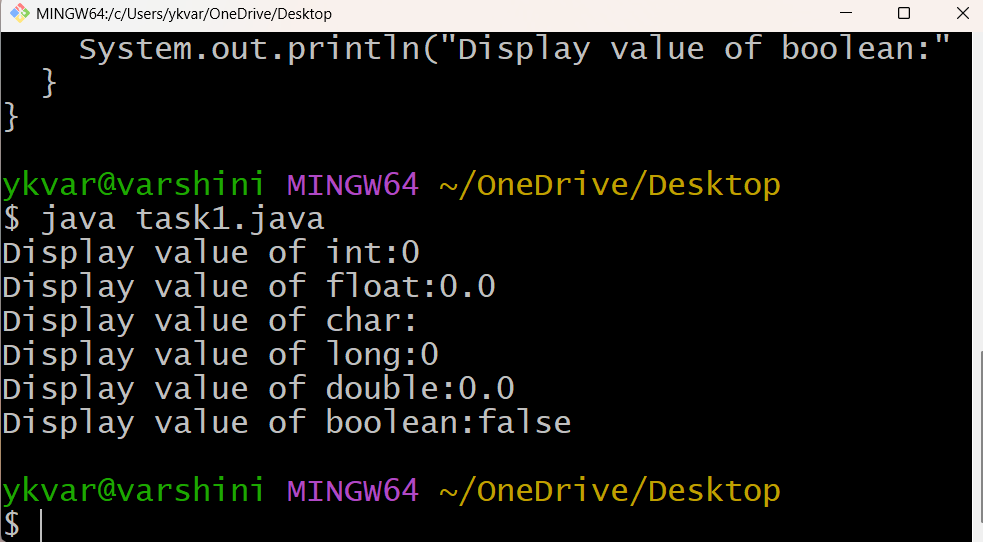
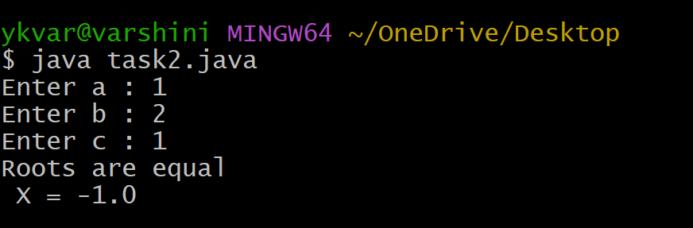

# EXPERIMENT-1
## 1a) Title: Displaying Default Primitive Data Type Values.
## Source Code
```java
 class DisplayDefaultPrimitiveType{
    int primInt;
    float primFloat;
    char primChar;
    long primLong;
    double primDouble;
    boolean primBoolean;
  public static void main(String[] args){
    DisplayDefaultPrimitiveType dDPT = new DisplayDefaultPrimitiveType();
    System.out.println("Display value of int:" + dDPT.primInt);
    System.out.println("Display value of float:" + dDPT.primFloat);
    System.out.println("Display value of char:" + dDPT.primChar);
    System.out.println("Display value of long:" + dDPT.primLong);
    System.out.println("Display value of double:" + dDPT.primDouble);
    System.out.println("Display value of boolean:" + dDPT.primBoolean);
  }
}
```
## Output:

# Exp1b) Title: Calculate the roots of a Quadratic equation
## Source Code:
```java
 import java.util.Scanner;
 class QuadraticEquation{
    public static void main(String[] args)
  {
    Scanner sc =new Scanner(System.in);
    System.out.print("Enter a : ");
    double a = sc.nextDouble();
    System.out.print("Enter b : ");
    double b = sc.nextDouble();
    System.out.print("Enter c : ");
    double c = sc.nextDouble();
    double D = b*b-4*a*c;
    if(D>0){
      double X1 = (-b+Math.sqrt(D))/(2*a);
      double X2 = (-b-Math.sqrt(D))/(2*a);
      System.out.println("Two real roots");
      System.out.println(" X1 = " + X1);
      System.out.println(" X2 = " + X2);
    }
    else if(D==0){
      double X = -b/(2*a);
      System.out.println("Roots are equal");
      System.out.println(" X = " + X);
    }
    else{
      double real = -b/(2*a);
      double img = Math.sqrt(-D)/(2*a);
      System.out.println("Roots are complex(no real roots)");
      System.out.println(" X1 = " + real + "+" + img + "i");
      System.out.println(" X2 = " + real + "-" + img + "i");
    }
    sc.close();
  }
}
```
## Output:
CASE-1 (D>0)


CASE-2 (D==0)




