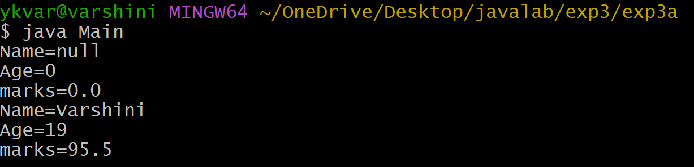

# Experiment-3a
## 3a) Title: Implement Constructor Overloading In Java.
## Source Code
```
class Student { 
    String name; 
    int age; 
    double marks; 
    Student() {
    }
    Student(String name, int age, double marks){
        this.name=name;
        this.age=age;
        this.marks=marks;
    }
    void display(){
        System.out.println("Name="+name);
        System.out.println("Age="+age);
        System.out.println("marks="+marks);
    }
}

```
## Output

