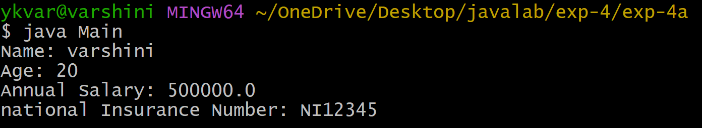
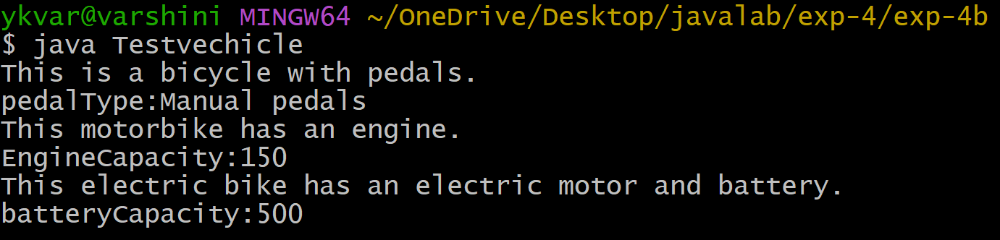

## Experiment-4a
## Title:Implementing single inheritance
## Source Code:
``` java
class Person{
    String name;
    int age;
    Person(String name,int age){
      this.name= name;
      this.age= age;
    }
    void displayPersonDetails(){
         System.out.println("Name: " + name);
         System.out.println("Age: " + age);
   }
 }
class Employee extends Person{
     double annualSalary;
     int YearofJoining;
     String NationalInsuranceNumber;
     Employee(String name,int age,double annualSalary,int YearofJoining,String NationalInsuranceNumber){
     super(name, age);
     this.annualSalary = annualSalary;
     this.YearofJoining = YearofJoining;
     this.NationalInsuranceNumber = NationalInsuranceNumber;
     }
     void displayEmployeeDetails() {
          displayPersonDetails();
          System.out.println("Annual Salary: " + annualSalary);
          System.out.println("national Insurance Number: " + NationalInsuranceNumber);
       }
   }
class Main{
    public static void main( String[] args){
          Employee emp = new Employee("varshini",20,500000.0,2025,"NI12345");
          emp.displayEmployeeDetails();
    }
 }
```
## Output:


 Experiment-4b
## Title:Implementing multi level Inheritance
## Source Code:
``` java
class Bicycle { 
      String pedalType; 
      void showBicycleInfo() {
           System.out.println("This is a bicycle with pedals.");
           System.out.println("pedalType:" + pedalType);
      }
   }
class Motorbike extends Bicycle {
      int engineCapacity;
      void showMotorbikeInfo() {
           System.out.println("This motorbike has an engine.");
           System.out.println("EngineCapacity:" + engineCapacity);
      }
  }

class ElectricBike extends Motorbike {
      int batteryCapacity;
      void showElectricBikeInfo() {
           System.out.println("This electric bike has an electric motor and battery.");
           System.out.println("batteryCapacity:" + batteryCapacity);
      }
  }
  
class Testvehicle {
      public static void main(String[] args) {
      ElectricBike ebike = new ElectricBike();
      ebike.pedalType = "Manual pedals";
      ebike.engineCapacity = 150;
      ebike.batteryCapacity = 500;
      ebike.showBicycleInfo();
      ebike.showMotorbikeInfo();
      ebike.showElectricBikeInfo();
    }
  }
```
## Output:

   
